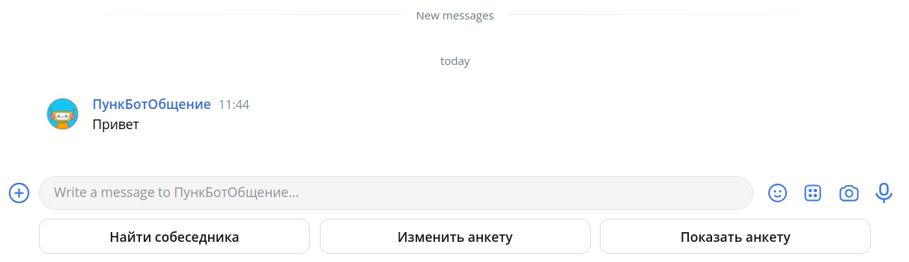

# PunkChatBot

## About

[//]: # (![Bot avatar]&#40;markup/botAvatar.jpg 250x250&#41;)

Chat ~~roulette~~ bot for finding people to talk for SPbU students.

## Rules

* 📜 It's only allowed to send text messages
* 💣 You have an opportunity to ban user if he doesn't behave good
* 📤 You may enter the community only if someone will share an invitation link with you
    * You are responsible for those who you invite: if they behave badly, community can easily find who is responsible
      for invitation
* ⏲ You have only one 12 hours to speak with your interlocutor (so you'd rather don't spend time wastefully 😉)
* 🔕 It's not allowed to send any kind of links

## Development

- [ ] Invitation System
- [ ] Interlocutor finding
- [ ] Message transfer
- [ ] Ban system
- [ ] Form filling keyboard
- [ ] Chat timer
- [ ] Logging system

____

## Environment

1) Ubuntu 20.04 (with **systemd** init system)
2) MongoDB Community Edition
    1) Running **mongod** service (sudo systemctl status mongod
       )
    2) Interactive work through mongosh
    3) *chatbot* db (collections: userForm)

## Contribution:

If you'd like to help in developing this bot, write to me on:  
Vk: https://vk.com/general_bum  
Telegram :  @EmirVildanov

If you would like to edit diagrams again write to me, and I will give give you an editor rights:

* [**Link**](https://online.visual-paradigm.com/share.jsp?id=313930363330382d31) to Chat StateMachine diagram
* [**Link**](https://dbdiagram.io/d/624954fad043196e39e57e3c) to DataBase diagram  

